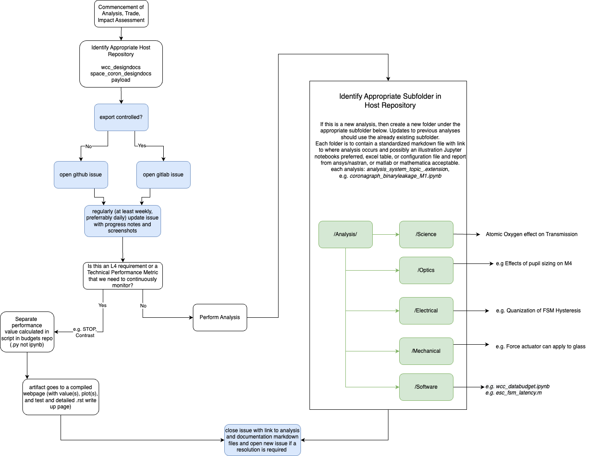

Code and Analysis Storage
==============================

When developing tools and/or analyses that are to be used by people within the group, the code should be stored within a repository in the UASAL group.
This is to ensure that code is not stored in personal repositories where access is controlled by only a single person. 
It also promotes contributions from your colleagues via the healthy development practices discussed in this guide.

Notebooks
---------
Notebooks are powerful tools and are especially useful for generating code and reports under a common file. 
However, when developing a more formal tool or package, the notebooks contained within that package (in a `notebooks` folder) are to be example notebooks only, and not the code repo itself.

Analysis Storage
----------------

So where should your analyses go? It depends upon the situation.

If writing a paper, then the code can be included in the git repository that contains the latex files.
This is encouraged as then the people you share the paper with will have access to the code as well (assuming you're using Overleaf). 

Analysis Storage for the Space Telescope Project
------------------------------------------------

For those of us working on the Space Telescope Project, a scheme has been developed to put the analyses into documentation.

The following flow chart indicates how a location should be chosen.
It also provides guidance on where to create the ticket.

   Follow this chart to determine where to make an issue and how to store your artifact

Inside your analysis directory, which you will create, it is important to generate the following files:

- `README.md` - This is to explain the contents of the directory, the reason for performing the analysis, and what it affects. A description of key input and output files is also encouraged. Also helpful is how long it takes the code to run and on which hardware.
- Details regarding the environment in which it was run. This could be showing the key installed package/repository versions from within a notebook, by supplying the details of a conda environment, or by providing a manual write-up.  
- The code to run the analysis (e.g. a python script, jupyter notebook)
- A report of the final results, including any limitations, or impact to requirements/budgets etc.
   - If including a figure, high-resolution versions that support transparency (e.g. PNG) are preferred.

Areas of analyses storage are as follows:

- `ESC related analyses <https://github.com/uasal/spacecoron_design_docs/tree/develop/Analysis>`_
- `WCC related analyses <https://github.com/uasal/wcc_designdocs/tree/develop/Analysis>`_
