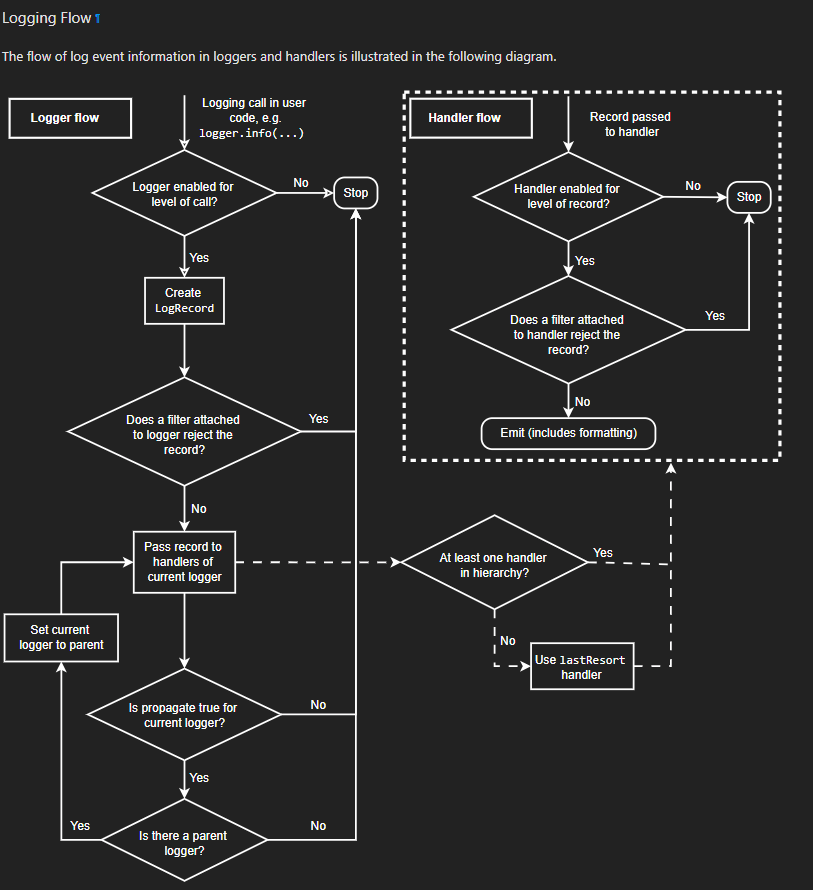

Python Logging Guide
====================

Introduction
============

This is an intermediate level guide, written for people who may not have experience in logging, but have some experience with python, object oriented programming and package development. This guide will discuss the `logger` module in python specifically, and the suggested practices for implementing logging when developing packages at UASAL. 

Users are encouraged to look at the `Logging HOWTO <https://docs.python.org/3/howto/logging.html>`__ tutorial on the python website. If you have already been there and there is way too much information, and you would like a streamlined version of logging for your needs, this guide will reproduce some material from the tutorial, and add additional guidelines and suggestions specifically for UASAL package development.

Basic Usage
===========

To get started with logging, the user needs to add a logger to their UASAL package/script. This output will go to the terminal. The options to change where the output logs go is discussed further in the :ref:`Where do the log messages go?` Section. The basic logger usage is fairly straightforward and can be seen in `this gist <https://gist.github.com/sfrinaldi/df1f2711b70e209a161321231adf1d58>`__ ::

	import logging
	logger = logging.getLogger(__name__)

	# Test log statements
	logger.debug("Testing log debugs")
	logger.warning("Testing log warnings")
	logger.info("Testing log info")
	logger.error("Testing log errors")
	logger.critical("Testing log criticals")

The workflow is to import a logger, and use the logger to log messages. The logger recognizes the pre defined set of levels, which are also function calls for specific messages. 

##############
Why not print?
##############

A really simple question to ask is: *Why do I want to use a logger and not simply print statements in my code?* 

This is a reasonable question and the answer depends on your use case. There are logistical and scientific reasons for logging instead of printing. If you are managing a relatively simple script, maybe a print statement is in fact the best way to go. But, if you are working with a complicated package, peppering the code with print statements to debug a problem has three main issues: 

1. Cleanup overhead - you probably have to go back and comment out most statements as you will not want them once the code starts to work. 
2. Lack of context - a print statement does not contain information about the line of code/date/time that triggered it, unless explicitly specified.
3. Noise when debugging - a large number of print statements is often redundant when debugging, since we are usually interested in the last few statements before something breaks, requiring the user to sift through a number of print statements to identify the important one. 

Loggers are a strong way of circumventing these problems: 

1. They support log levels (DEBUG, INFO, WARNING, ERROR, etc.), so you can control the verbosity without modifying your code.
2. They can be configured to automatically include timestamps and source information as needed.
3. You can direct their output to multiple destinations (console, files, remote systems) and format it consistently.

Additionally, there is a strong reason from a scientific point of view to use logging as well for transparency, traceability and reproducibility of results. When logs are well-placed and informative they act as a lab-book for the data / results generated by the code.

#############
Logger Levels
#############

Logger levels essentially quantify "How badly do I, the user, need to know this information?" The levels are numeric values, but are also associated with predefined keywords chosen on the basis of shared practical experience. Here's the list (Emphasized text is taken verbatim from the logging guide) - 

1. Critical (Logger level numeric value - 50) - The user absolutely needs to know about this. *A serious error, indicating that the program itself may be unable to continue running*.

2. Error (Logger level numeric value - 40) - The user should be told about this at runtime. *Due to a more serious problem, the software has not been able to perform some function*.

3. Warning (Logger level numeric value - 30) - This may or may not be something the user needs to know, as the software didn't break, for now. *An indication that something unexpected happened, or indicative of some problem in the near future (e.g. ‘disk space low’). The software is still working as expected*.

4. Info (Logger level numeric value - 20) - This just gives user regular updates about the software which is running as expected. *Confirmation that things are working as expected.*

5. Debug (Logger level numeric value - 10) - Detailed information, which the user almost never wants, and is typically useful for the code maintainers/designers. *Detailed information, typically of interest only when diagnosing problems.*

A special note on the `log.warning()` keyword. Python has an additional package called `warnings` which also contains the `warnings.warn()` method, utilized frequently by packages. The distinction between the use of these packages is completely dependent on the package designer, BUT it is advisable to follow the following convention: *`warnings.warn()` in library code if the issue is avoidable and the client application should be modified to eliminate the warning. A logger’s `log.warning()` method if there is nothing the client application can do about the situation, but the event should still be noted.*

Now if we go back to our printing problem, we can instead replace them in the code with `logger.debug()` statements instead, which will only be printed when the logger itself is configured to print out debug messages. Once the problem is solved, we can leave the logging code in there, and simply switch the logger to an information only mode. No more commenting back and forth!

Intermediate/Advanced Usage
===========================

A standard logger workflow is illustrated in the following flowchart - 

|image1|

While convenient to quickly use the logger defined above in a short script, when developing a package, it is useful to define a separate logger class to be used by the package with a number of pre-set default values that configure the logger. Here we outline the suggested practice for incorporating a custom logger into a UASAL package.

A complete code snippet that can be copy-pasted into a package can be found `here <https://gist.github.com/sfrinaldi/ae2155aac8acbc6d6cc1ec750610022a>`__. 
::

   ├── docs
   ├── notebooks
   │   ├── sample_notebook.ipynb
   ├── pyproject.toml
   ├── README.md 
   ├── src
   │   ├── package_name
   │   │   ├── source_code.py
   │   │   ├── __init__.py
   │   │   ├── packaged_directory
   │   │   │   └── data.csv
   │   │   └── _version.py
   └── tests
       └── test.py

Create a new file `logger.py` in the `src/package_name` directory. Inside this file, import the code from `the gist here <https://gist.github.com/sfrinaldi/ae2155aac8acbc6d6cc1ec750610022a>`__. Modify the default parameters to suit the needs of your package. Once this has been added, inside the `source_code.py` file, add ::

	from logger import logger
	
	class foo:
		def __init__(self):
			self.log = logger()

When importing a package that implements its own custom logger, the logger is automatically referenced as `foo.log` and all logging methods can be used with this object. 

######################
What is a log handler?
######################

A log `handler` is a special method that contains a predefined set of functions to parse the log into various formats. There are a large number of pre defined handlers, some of the more commonly used examples are `StreamHandler <https://docs.python.org/3/library/logging.handlers.html#logging.StreamHandler>`__ to manage logs into system streams such as `stdout`, `FileHandler <https://docs.python.org/3/library/logging.handlers.html#logging.FileHandler>`__ to handle basic file read/write functions, `TimedRotatingFileHandler <https://docs.python.org/3/library/logging.handlers.html#logging.handlers.TimedRotatingFileHandler>`__ a slightly more advanced file handler that periodically rotates/wipes log files and runs maintanence tasks, and lastly, `NullHandler <https://docs.python.org/3/library/logging.handlers.html#logging.NullHandler>`__ which does nothing with error messages and is useful when you want to retain your logging architecture and messages, but don't want to actually log anything, and is also useful in bypassing certain error messages. 

Simple example to set up a file handler ::

	import logging
	logger = logging.getLogger()
	
	fh = logging.FileHandler(filename=<LOGFILE_NAME>, mode='a', encoding='utf-8', delay=False, errors=None)
	fh.setLevel(logging.DEBUG) # Sets the level you want to be recorded within the log file
	logger.addHandler(fh)

###############################
How to format the log messages?
###############################

Users can format their messages to customize exactly what information is logged and how it is formatted. A basic code snippet for formatting is 
::

	import logging
	logging.basicConfig(format='%(levelname)s:%(message)s', level=logging.DEBUG)

The other way is to set the formatter for a specific handler 
::

	import logging
	logger = logging.getLogger()
	format="%(asctime)s - %(pathname)s[line:%(lineno)d] - %(levelname)s - %(message)s", # Format for log messages
	formatter = logging.Formatter(format) 
	
	#	To set the format for a specific handler
	ch = logging.StreamHandler() 
	ch.setFormatter(formatter)
	logger.addHandler(ch)

Note that the `log` we get from the `getLogger` method is the Root logger, and does not have the `setFormatter` method. 

The keywords accepted by the log formatter (`levelname`, `message`, etc..) are called the LogRecord attributes and `a complete list of these can be found here <https://docs.python.org/3/library/logging.html#logrecord-attributes>`__.

#############################
Where do the log messages go?
#############################

This depends on the handler and the general setup. If you boot up a standard python console, this is the result of the log commands
::

	>>> import logging
	>>> logger = logging.getLogger()
	>>> logger.debug("Testing log debugs")
	>>> logger.warning("Testing log warnings")
	Testing log warnings
	>>> logger.info("Testing log info")
	>>> logger.error("Testing log errors")
	Testing log errors
	>>> logger.critical("Testing log criticals")
	Testing log criticals

So the default behavior is to print everything above a warning to screen. If you haven't configured a FileHandler, none of this gets saved to a log file. You can change the output here by changing the level of your root logger. You can save all of this information to a file by configuring and adding a FileHandler.

###############################################
Root Logger Level, Handler Level and throughput
###############################################

Loggers are effectively a chain of communication. The chain starts with the `logger` object, which then usually hands it off to one of the Handlers, or multiple handlers. The important thing to note is that *ALL OF THESE OBJECTS CAN SET THEIR OWN LEVEL*. In these circumstances, it is advisable to set the root logger's default level as Debug, so that all logged messages are passed on to the handlers. The handler levels can then be set to filter out a certain set of messages. For example, in this setup 
::

	import logging

	# Variable defaults for Logger Class
	DEFAULT_LOGFILE = 'package-name.log' # Optional / Use `package-name.log` naming convention when possible
	DEFAULT_LEVEL = logging.DEBUG # Min level for logger to use for log handlers
	STREAM_LEVEL = logging.INFO # Min Level for the log stream handlers
	FILE_LEVEL = logging.DEBUG # Min level for recording to file

	class Logger:

		def __init__(
		        self,
		        level=DEFAULT_LEVEL, # Used to set min level for log
		        format="%(asctime)s - %(pathname)s[line:%(lineno)d] - %(levelname)s - %(message)s", # Format for log messages
		):
		    self.logger = logging.getLogger()
		    self.logger.setLevel(DEFAULT_LEVEL) # Sets the lowest level allowed for all logger handlers 
		    formatter = logging.Formatter(format) 

		    # Setup Handlers -------------------------------------------------
		    ## Writes to the Stream  / Setup Format
		    ch = logging.StreamHandler() 
		    ch.setLevel(STREAM_LEVEL) # Sets the level you want to be output to the terminal / stream
		    ch.setFormatter(formatter)

		    ## Writes to a log file using FileHandler (basic handler)
		    fh = logging.FileHandler(filename=DEFAULT_LOGFILE, mode='a', encoding='utf-8', delay=False, errors=None)
		    fh.setLevel(FILE_LEVEL) # Sets the level you want to be recorded within the log file
		    fh.setFormatter(formatter)

		    # Add Handlers
		    self.logger.addHandler(fh)
		    self.logger.addHandler(ch)

We have a `DEFAULT_LEVEL` for the root logger, an `INFO` level for the `StreamHandler`, which outputs logs to the screen, and a `DEBUG` level for the `FileHandler`. Now, as written, all logs will go to the file but only `INFO` and above will be shown on screen. However, in this case if we change the `DEFAULT_LEVEL` to `INFO`, now the root logger no longer accepts/logs `DEBUG` messages, and even though the `FileHandler` is configured to accept `DEBUG` messages, no such messages are coming from Root, and thus no `DEBUG` messages will be seen in the written log! 

**It is a game of communication, and if we bottleneck an earlier step in the chain to reject a certain level of messages, they will not propagate down the line!**

##################################################
Guidelines for use of loggers in notebooks/scripts
##################################################

Once the loggers have been set up using a dedicated class for the entirety of the package, they can be called individually. For example, if we import `package1` and `package2`, which both have a `.log` attribute, containing a logger object, with the specified defaults as shown in the gist code, then individual loggers can be manipulated by calling logging methods for the `package1.log` and `package2.log` objects. 

The notebook/script can have its own dedicated logger object, which can be specified in a similar manner to that for the package above by importing a class, or by defining a logger explicitly from within the script/notebook including the corresponding format and handlers.

