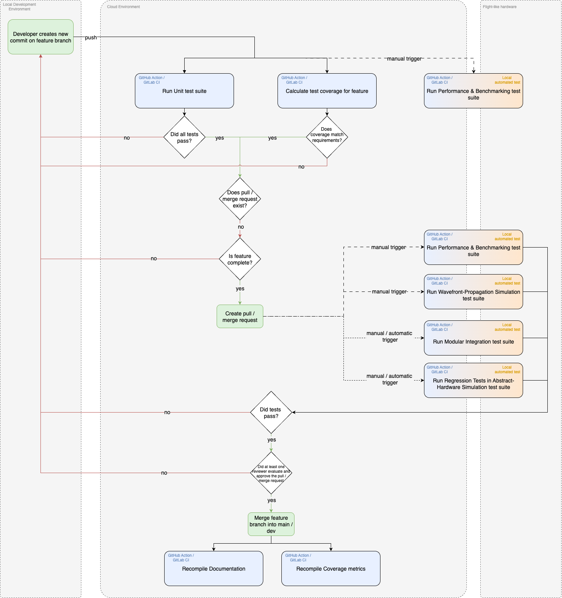

Testing Strategy
================

This Testing Strategy defines the organized framework used to verify and validate the software components that support instrument operations. It builds on years of successful on-sky usage of the software, ensuring we capture both code quality and real-world performance metrics.

Objectives
----------------------

The goal of this strategy is to deliver reliable, high-quality software through early defect detection and objective quality measurement.

To complement coverage metrics, the XWC framework has been (and is continuing to be) used on-sky for a total of XX nights, providing a direct measure of field reliability.

Coverage and Field-Use Metrics
-------------------------------

We maintain quantitative targets for automated tests and supplement these with operational performance indicators:

- XWCTk: 100 % function coverage and a minimum of 95 % line coverage, with a monthly increase target of 10 % until the goal is met.
- XWC Applications: The baseline requirement is 100 % function and 95 % line coverage. Exceptions to this requirement are allowed for lines/functionalities that are difficult to target and are not considered critical, but they must be discussed, justified and documented. A risk management board will be implemented to track these exceptions.
- Libraries developed in-house or by connected groups:

    - Critical apps require 100 % function and 90 % line coverage.
    - Important apps require 100 % function and 80 % line coverage.

- On-Sky Usage:
    - Total number of XX nights so far.

Layered Testing Approach
----------------------------

Our testing framework is organized into sequential layers, each designed to catch different classes of defects:

Unit Tests
~~~~~~~~~~~

Developers write unit tests for all new code. Backfilling existing code with unit tests is a shared team responsibility. The codebase and every function must be covered according to our targets.

The full unit test suite should run on every commit, on every branch.

Modular Integration Tests
~~~~~~~~~~~~~~~~~~~~~~~~~~~

These tests verify interactions within defined subsystems. Examples include:

- Data-saving workflows spanning acquisition, formatting, and persistence modules
- Power-management sequences for application startup, shutdown, and fault recovery

The integration test suite should be run before merging new code to the main branch and must pass for the merge to be approved.

Regression Tests in Abstract-Hardware Simulation
~~~~~~~~~~~~~~~~~~~~~~~~~~~~~~~~~~~~~~~~~~~~~~~~~

End-to-end scenarios recreate full observation sequences, with fault-injection capabilities to validate error handling.

The regression test suite should be run before merging new code to the main branch and must pass for the merge to be approved.

Performance & benchmarking tests
~~~~~~~~~~~~~~~~~~~~~~~~~~~~~~~~~~

These tests are performed on the Ground System (see :ref:`ground-system`) or at least equivalent computer hardware and allow measurement and tracking of latency, throughput and resource usage across updates and usage scenarios.

Wavefront-Propagation Simulation Tests
~~~~~~~~~~~~~~~~~~~~~~~~~~~~~~~~~~~~~~~

Scientific algorithms are exercised against abstract-hardware models. This will include physical optics propagation of wavefronts with spatio-temporal aberrations based on expected system behavior, and non-linear simulators of wavefront control components. The goal is to enable testing of wavefront sensing algorithms and control loops with abstract-hardware simulations.

.. _ground-system:

Ground System Testing
~~~~~~~~~~~~~~~~~~~~~~~~~~~

A functionally complete physical replica of flight running the full suite of flight software.
Before start of mission it is used for harware and software testing to validate a flight-like observation sequence with a telescope simulator and ground-segment simulator.
Subsequently it supports on-site troubleshooting of operations.

Test Environments and Infrastructure
-------------------------------------

We leverage both cloud-based CI runners and dedicated hardware to ensure consistency and realism:

1. Continuous Integration (GitHub Actions / GitLab CI) executes unit tests on every commit, as well as integration tests, regression test, static analysis, and coverage reporting on every pull request.

The figure below summarizes the full CI and testing workflow, from a developer pushing a commit to on-site hardware validation.

   Continuous Integration and Testing workflow

2. A functionally complete ground hardware unit enables software and hardware testing and validation of flight-like observation sequences with a telescope simulator and ground-segment simulator, as well as troubleshooting of mission operations.

The ground system will have all the components of the flight system, presenting the same interfaces, such that the same software will be run on both systems without modification.